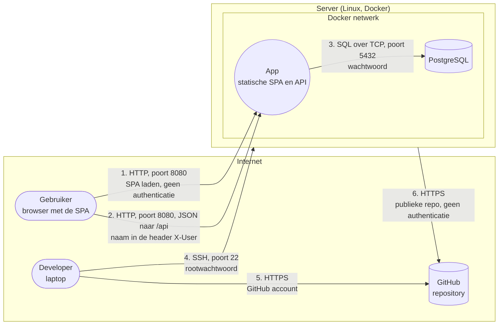

# Basis threat model van de starter app

Dit is het vertrekpunt voor wie opdracht 1 niet heeft. Het beschrijft de starter app zoals ze is: zonder pipeline, zonder WAF, zonder inloggen. Vul het aan in elke opdracht.

## Architectuur

Vertrouwensgrenzen: tussen de browser en de server, tussen het internet en de server, en tussen de server en het Docker netwerk. Let op: de SPA draait in de browser van de gebruiker. Alles wat de SPA controleert, kan een aanvaller omzeilen. Enkel wat de API controleert, telt.

## Dreigingen

Formulering: een A doet B op C door D, wat leidt tot E.

| # | STRIDE | Dreiging | Maatregel | Opdracht |
|---|---|---|---|---|
| 1 | Spoofing | Een gebruiker zet de naam van iemand anders in de header X-User, door het ontbreken van authenticatie, wat leidt tot het lezen van andermans berichten | Inloggen via een identity provider, tokens die de API valideert | 4 |
| 2 | Information disclosure | Een aanvaller luistert het verkeer af op flow 1 en 2, door het gebruik van HTTP, wat leidt tot het lekken van berichten | HTTPS | 2 |
| 3 | Information disclosure | Een beheerder of aanvaller met toegang tot de databank leest alle berichten, doordat ze onversleuteld bewaard worden, wat leidt tot verlies van vertrouwelijkheid | End to end encryptie | 3 |
| 4 | Elevation of privilege | Een gebruiker vraagt een bericht op met het id van iemand anders, door het ontbreken van autorisatie, wat leidt tot het lezen of verwijderen van andermans berichten | Autorisatie per bericht | 5 |
| 5 | Information disclosure | Iemand met toegang tot de repository leest het databankwachtwoord, doordat het in de configuratie staat, wat leidt tot volledige toegang tot de databank | Geheimen in een secrets manager | 6 |
| 6 | Tampering | Een aanvaller stuurt kwaadaardige invoer via een invoerveld, door onvoldoende validatie of encoding, wat leidt tot het uitvoeren van code of queries | Secure coding, SAST en een WAF | 2 |
| 7 | Tampering | Een aanvaller verstopt kwaadaardige code in een bibliotheek die de app gebruikt, door het ontbreken van controle op afhankelijkheden, wat leidt tot overname van de app | SCA in de pipeline | 2 |
| 8 | Spoofing | Een aanvaller raadt het rootwachtwoord van de server via flow 4, door aanmelden met wachtwoord, wat leidt tot overname van de server | SSH sleutels, fail2ban | 2 |
| 9 | Denial of service | Een aanvaller overspoelt de app met requests, door het ontbreken van rate limiting, wat leidt tot onbeschikbaarheid | Rate limiting in de WAF | 2 |
| 10 | Repudiation | Een gebruiker ontkent dat hij een bericht stuurde, doordat de afzender niet bewezen wordt en er geen logging is, wat leidt tot discussie zonder bewijs | Authenticatie, handtekeningen en logging | 3 en 4 |
